# miningos-wrk-miner-avalon

A worker service for managing and monitoring Avalon cryptocurrency mining devices. This implementation provides comprehensive control over Avalon miners, including the A1346 model, with support for monitoring, configuration, and remote management.

## Table of Contents

1. [Overview](#overview)
2. [Object Model](#object-model)
3. [Features](#features)
4. [Requirements](#requirements)
5. [Installation](#installation)
6. [Configuration](#configuration)
7. [Usage](#usage)
8. [Data Collection](#data-collection)
9. [Error Monitoring](#error-monitoring)
10. [Alerts](#alerts)
11. [Mock Server](#mock-server)
12. [Development](#development)

## Overview

This worker extends the abstract miner worker framework to provide specific functionality for Avalon mining hardware. It implements the TCP-based Avalon protocol for device communication and provides a standardized interface for mining operations management.

## Object Model

The following is a fragment of [MiningOS object model](https://docs.mos.tether.io/) that contains the concrete classes representing **Avalon miner workers** (highlighted in blue), one generically representing any model of the brand, and one child class specifically representing model A1346. The rounded nodes reprsent abstract classes while the square nodes represent concrete classes:

```mermaid
---
title: Object Model of MiningOS
---
flowchart RL
    bfx-wrk-base@{ shape: stadium, label: "*bfx-wrk-base*" }


    tether-wrk-base@{ shape: stadium, label: "*tether-wrk-base*" }
    tether-wrk-base--->bfx-wrk-base


    miningos-tlp-wrk-thing@{ shape: stadium, label: "*miningos-tlp-wrk-thing*" }
    miningos-tlp-wrk-thing--->tether-wrk-base


    miningos-tpl-wrk-miner@{ shape: stadium, label: "*miningos-tpl-wrk-miner*" }
    miningos-tpl-wrk-miner--->miningos-tlp-wrk-thing


    miningos-wrk-miner-avalon["miningos-wrk-miner-avalon"]
    miningos-wrk-miner-avalon--->miningos-tpl-wrk-miner

    miningos-wrk-miner-avalon-a1346["miningos-wrk-miner-avalon-a1346"]
    miningos-wrk-miner-avalon-a1346--->miningos-wrk-miner-avalon


    style miningos-wrk-miner-avalon fill:#005,stroke-width:4px,color:white
    style miningos-wrk-miner-avalon-a1346 fill:#005,stroke-width:4px,color:white
```



Check out [miningos-tpl-wrk-miner](https://github.com/tetherto/miningos-tpl-wrk-miner/) for more information about parent classes.

## Features

### Core Functionality
- **Device Management**: Register, update, and remove Avalon miners
- **Real-time Monitoring**: Collect performance metrics and device status
- **Pool Management**: Configure and monitor mining pools
- **Power Control**: Sleep, normal, and high-performance modes
- **Network Configuration**: Static and DHCP network settings
- **Temperature Monitoring**: Chip-level temperature tracking
- **Error Detection**: Comprehensive error monitoring and alerting

### Supported Operations
- Reboot device
- Set LED status
- Configure fan speed
- Factory reset
- Update passwords
- Set Mining pool server urls
- Suspend/resume mining

## Requirements

- Node.js (>= 20.0)

## Installation

1. Clone the repository
2. Install dependencies:
   ```bash
   npm install
   ```
3. Configure the worker using the example configuration files:
   ```bash
   ./setup-config.sh
   ```

## Configuration
Generic: https://github.com/tetherto/miningos-tpl-wrk-thing/blob/main/README.md#configuration

## Usage

### Starting the Worker

```bash
node worker.js --wtype=wrk-miner-rack-a1346 --env=production --rack=rack01
```

### Registering a Miner

The worker exposes RPC endpoints for miner management. To register a new Avalon miner:

```javascript
{
  "method": "registerThing",
  "params": {
    "opts": {
      "address": "192.168.1.100",
      "port": 4028,
      "password": "root",
      "timeout": 30000
    },
    "info": {
      "serialNum": "AV123456",
      "macAddress": "00:11:22:33:44:55",
      "pos": "1",
      "container": "container-01"
    },
    "tags": ["production", "site-1"]
  }
}
```

### Available RPC Methods

- `getRack`: Get rack information
- `listThings`: List all managed miners
- `registerThing`: Register a new miner
- `updateThing`: Update miner configuration
- `forgetThings`: Remove miners
- `queryThing`: Query individual miner methods
- `applyThings`: Apply operations to multiple miners
- `tailLog`: Retrieve historical data

### Miner Control Commands

Once registered, miners can be controlled through the `queryThing` RPC method:

```javascript
// Reboot a miner
{
  "method": "queryThing",
  "params": {
    "id": "miner-id",
    "method": "reboot",
    "params": []
  }
}

// Set pools
{
  "method": "queryThing",
  "params": {
    "id": "miner-id",
    "method": "setPools",
    "params": []
  }
}

// Set power mode
{
  "method": "queryThing",
  "params": {
    "id": "miner-id",
    "method": "setPowerMode",
    "params": ["high"] // "sleep", "normal", or "high"
  }
}
```

## Data Collection

The worker automatically collects snapshots every 5 minutes (configurable) containing:

### Statistics
- Hashrate metrics (30s, 1m, 5m, 15m averages)
- Power consumption and efficiency
- Temperature readings (ambient, chip-level)
- Pool share statistics (accepted, rejected, stale)
- Uptime and error status

### Configuration State
- Network settings
- Pool configurations
- Power mode
- LED status
- Firmware version

## Error Monitoring

The system monitors for various error conditions:

- **Pool Errors**: Dead pools, connection failures
- **Power Errors**: PSU failures, short circuits
- **Temperature Errors**: Overheating conditions
- **Hashboard Errors**: Hardware failures, abnormal states
- **Control Board Errors**: Communication issues

## Alerts

Custom alerts can be configured, including:

- **Chip Temperature Critical**: Triggers when chip temperature exceeds threshold
- Standard miner alerts inherited from the base framework

## Mock Server

A mock server is provided for testing without physical hardware:

```bash
node mock/server.js --type A1346
```

The mock server simulates Avalon protocol responses for all supported commands.

## Development

### Running Tests

```bash
npm test
```

### Adding New Miner Models

1. Create a new worker class extending `WrkMinerRack`:
   ```javascript
   class WrkMinerRackNewModel extends WrkMinerRack {
     getThingType() {
       return super.getThingType() + '-newmodel'
     }
   }
   ```

2. Update constants for model-specific parameters
3. Override methods as needed for model-specific behavior
